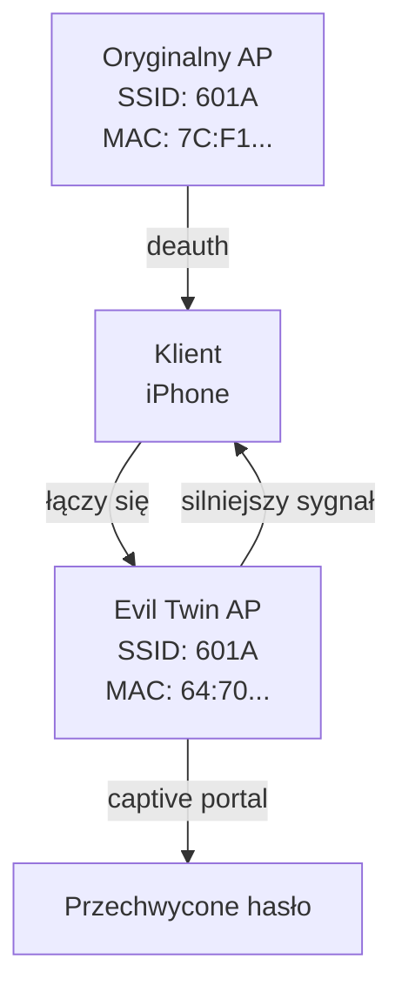

# Ataki Evil Twin, KARMA i MANA

## Analiza, detekcja i przeciwdziałanie

<div class="pt-12">
  <span class="text-xl opacity-50">Bezpieczeństwo Sieci Bezprzewodowych</span>
</div>

<div class="abs-br m-6 flex gap-2">
  <span class="text-sm opacity-50">AGH WIEiT, 2026</span>
</div>

---
layout: default
---

# Agenda

<div class="grid grid-cols-2 gap-8 pt-4">

<div>

### 🔴 Ataki
1. **Evil Twin** – klonowanie SSID, deauth, captive portal
2. **KARMA** – pasywne przechwytywanie probe requestów
3. **MANA** – zaawansowany (directed probes + loud mode)

### 🛡️ Detekcja
4. Metoda 1: **Fingerprinting IE**
5. Metoda 2: **Analiza RSSI**
6. Metoda 3: **Sequence Numbers**

</div>

<div>

### 📊 Wyniki praktyczne
7. Środowisko laboratoryjne
8. **Eksperyment: 10 cykli ON/OFF**
9. Porównanie metod ataku
10. Wnioski i mitygacja

</div>

</div>

---
layout: two-cols
---

# Czym jest Rogue AP?

<v-clicks>

- Nieautoryzowany punkt dostępowy **podszywający się** pod legalną sieć
- Klient **nie widzi różnicy** – standard 802.11 nie weryfikuje tożsamości AP
- Atakujący może:
  - Przechwycić **hasło Wi-Fi** (captive portal)
  - Przechwycić **ruch sieciowy** (MITM)
  - **Kradzież poświadczeń** EAP (sieci enterprise)

</v-clicks>

::right::

<div class="ml-4 mt-20">



</div>

---
layout: two-cols
---

# Atak 1: Evil Twin

### Mechanizm

1. Klonujemy **konkretny SSID** (np. 601A)
2. Wysyłamy **ramki deauth** do klientów
3. Klient traci połączenie z oryginałem
4. Klient łączy się z **naszym AP** (silniejszy sygnał)
5. Captive portal → **przechwytujemy hasło**

### Nasz setup

| Komponent | Specyfikacja |
|---|---|
| Karta atakującego | TP-Link TL-WDN3200 (RT5572) |
| Oryginalny AP | Router domowy 601A |
| Ofiara | iPhone (MAC: BA:A1:0E:08:E0:35) |
| Narzędzia | create_ap, aireplay-ng, tcpdump |

::right::

<div class="mt-10">

## 📊 Nasze wyniki

**Eksperyment: 10 cykli ON/OFF**

- 🟢 Evil Twin AP: `64:70:02:18:B9:22`
- 🔴 Oryginalny AP: `7C:F1:7E:C1:7B:95`
- 📦 **55 490 pakietów** przechwyconych
- 📡 **6 810 beaconów** (2 928 Evil Twin + 3 882 oryginał)

<div class="text-green-500 font-bold text-xl mt-4">
✅ iPhone przechodził między AP przez 10 cykli!
</div>

</div>

---
layout: two-cols
---

# Atak 2: KARMA

### Karma Attacks Radio Machines Automatically

<div class="text-sm">

1. Rogue AP **nasłuchuje** probe requestów
2. Każdy klient wysyła zapytania o znane sieci
3. KARMA odpowiada beaconem z **żądanym SSID**
4. Klient łączy się automatycznie

</div>

### Kluczowa różnica

<div class="grid grid-cols-2 gap-4 mt-4">
<div class="bg-red-100 p-3 rounded">

**Evil Twin**
- Celuje w **1 konkretny SSID**
- Używa **deauth**
- Wiele BSSID → 1 SSID

</div>
<div class="bg-green-100 p-3 rounded">

**KARMA**
- Łapie **wszystkie SSID**
- **Bez deauth**
- 1 BSSID → **wiele SSID**

</div>
</div>

::right::

<div class="mt-10">

## Nasze wyniki

**hostapd-mana (enable_mana=0)**

Przechwycone probe requesty iPhone'a:

```
Probe Request (601A) -34 dBm
Probe Request (601A) -34 dBm
Probe Request (601A) -40 dBm
```

<div class="text-sm opacity-75 mt-2">
iPhone aktywnie szuka sieci 601A – KARMA przechwytuje
</div>

<div class="mt-4 p-3 bg-yellow-100 rounded text-sm">
<strong>Uwaga:</strong> KARMA <strong>nie wymusza</strong> rozłączenia. Klient sam decyduje czy się połączyć. Nowe iOS (10+) używają pasywnego skanowania – mniej probe requestów.
</div>

</div>

---
layout: two-cols
---

# Atak 3: MANA

### SensePost, Defcon 22

MANA = KARMA na sterydach:

<div class="text-sm">

- ✅ Odpowiada na **directed probe requests** (ignoruje docelowy BSSID)
- ✅ **Loud Mode** – emituje popularne SSID co ~10s
- ✅ **EAP Capture** – przechwytuje handshake dla sieci Enterprise
- ✅ **Multiple BSSID** – jeden interfejs → wiele wirtualnych AP

</div>

### Dlaczego MANA nas "nie rozłączyła"?

<div class="p-3 bg-blue-100 rounded mt-4 text-sm">
MANA to atak <strong>pasywny</strong> – czeka aż klient przyjdzie, nie wyrzuca go z sieci. Evil Twin używa <strong>deauth</strong> do siłowego przełączenia.
</div>

::right::

<div class="mt-10">

## Nasze wyniki

**hostapd-mana (enable_mana=1)**

```
MANA - Directed probe request
       for SSID '601A'
       from ba:a1:0e:08:e0:35
```

<div class="text-green-600 font-bold mt-2">
✅ MANA przechwycił directed probe requesty iPhone'a!
</div>

<div class="mt-4 text-sm">

| Metryka | Evil Twin | KARMA | MANA |
|---|---|---|---|
| Deauth | ✅ | ❌ | ❌ |
| Cel | 1 SSID | Wszystkie | Wszystkie + Loud |
| Skuteczność | Wysoka | Średnia | Bardzo wysoka |

</div>

</div>

---
layout: default
---

# Metody detekcji – przegląd

<div class="grid grid-cols-3 gap-6 mt-8">

<div class="border rounded p-4 text-center">

### 🔬 Metoda 1
**Fingerprinting IE**

Porównanie Information Elements w ramkach Beacon

<div class="text-2xl font-bold text-red-500 mt-4">15/18 IE</div>
<div class="text-sm opacity-75">różniących się</div>

<div class="text-sm mt-2">
HT Capabilities<br/>
Vendor Specific (OUI)<br/>
Power Constraint<br/>
Extended Capabilities
</div>

</div>

<div class="border rounded p-4 text-center">

### 📶 Metoda 2
**Analiza RSSI**

Monitorowanie poziomu sygnału

<div class="text-2xl font-bold text-red-500 mt-4">Δ 20.3 dBm</div>
<div class="text-sm opacity-75">różnicy</div>

<div class="text-sm mt-2">
Evil Twin: -22.3 dBm<br/>
Oryginał: -42.6 dBm<br/>
<span class="text-red-500">Anomalia!</span>
</div>

</div>

<div class="border rounded p-4 text-center">

### 🔢 Metoda 3
**Sequence Numbers**

Śledzenie numerów sekwencyjnych

<div class="text-2xl font-bold text-red-500 mt-4">2 strumienie</div>
<div class="text-sm opacity-75">niezależne</div>

<div class="text-sm mt-2">
Evil Twin: 0–2045<br/>
Oryginał: 0–4095<br/>
<span class="text-red-500">Brak nakładania!</span>
</div>

</div>

</div>

<div class="text-center mt-8 text-xl font-bold text-red-600">
🔴 WERDYKT: EVIL TWIN POTWIERDZONY wszystkimi trzema metodami
</div>

---
layout: default
---

# Metoda 1: Fingerprinting IE

<div class="grid grid-cols-2 gap-4">

<div>

## Bar Chart – porównanie IE


<div class="text-xs text-center mt-2 opacity-50">Czerwone = oryginalny router, Zielone = nasz Evil Twin</div>

</div>

<div>

### Co oznaczają słupki?

| IE | Oryginał | Evil Twin |
|---|---|---|
| **Szybkie WiFi (802.11n)** | ✅ | ❌ |
| **Producent (Vendor OUI)** | ✅ Microsoft | ❌ |
| **Ograniczenie mocy** | ✅ 0 dB | ❌ |
| **Szeroki kanał (40MHz)** | ✅ | ❌ |
| **Dodatkowe funkcje** | ✅ | ❌ |
| **Kraj działania** | ✅ | ❌ |

<div class="p-3 bg-yellow-100 rounded mt-4 text-sm">
<strong>Wniosek:</strong> Nasz Evil Twin (prosta karta USB) nie ma zaawansowanych IE. Oryginalny router ma wszystkie. To <strong>twardy dowód</strong> że to dwa różne urządzenia.
</div>

</div>

</div>

---
layout: default
---

# Metoda 2 i 3: RSSI + Sequence Numbers

<div class="grid grid-cols-2 gap-4">

<div>

### RSSI Boxplot

<div class="text-center text-lg font-bold">Δ = 20.1 dBm</div>


<div class="text-sm mt-2">
- Nasz AP: średnia <strong>-22.8 dBm</strong> (bardzo blisko)<br/>
- Oryginał: średnia <strong>-42.1 dBm</strong> (daleko)<br/>
- Różnica <strong>20 dBm</strong> = 100× silniejszy sygnał od naszego AP
</div>

</div>

<div>

### Sequence Numbers

<div class="text-center text-lg font-bold">10 cykli ON/OFF</div>


<div class="text-sm mt-2">
- Dwie niezależne linie = <strong>dwa urządzenia</strong><br/>
- "Górki" = cykle włączania/wyłączania AP<br/>
- Wrap-around co 4096 (12-bit licznik)<br/>
- <strong>Brak nakładania</strong> się zakresów seq#
</div>

</div>

</div>

---
layout: default
---

# Eksperyment: 10 cykli ON/OFF Evil Twin

<div class="grid grid-cols-3 gap-4 mt-4">

<div class="text-center">

### Przed wyłączeniem
iPhone na **Evil Twin**<br/>
`64:70:02:18:B9:22`

```text
iPhone ← Evil Twin
  RSSI: -29 dBm
  Szybkość: 54 Mbps
```

</div>

<div class="text-center">

### Po wyłączeniu AP
iPhone **bez Wi-Fi**<br/>
(przez ~5 sekund)

```text
iPhone odłączony
  Szuka sieci...
  Probe requesty: 601A
```

</div>

<div class="text-center">

### Po włączeniu AP
iPhone **wraca** na Evil Twin

```text
iPhone → Evil Twin
  Nowy seq#: od 0
  DHCP: nowy adres IP
```

</div>

</div>

<div class="mt-8 p-4 bg-gray-100 rounded">

### Statystyki z 10 cykli

| Metryka | Wartość |
|---|---|
| **Pakiety łącznie** | 55 490 |
| **Beacony Evil Twin** | 2 928 |
| **Beacony Oryginał** | 3 882 |
| **Średni czas reconnectu** | ~6 sekund |
| **Sukces reconnectu** | 10/10 (100%) |

</div>

---
layout: two-cols
---

# TLS SNI – podsłuchiwanie domen

### Nawet z szyfrowanym DNS!

<div class="text-sm">

- iPhone używa **DNS-over-HTTPS** (port 53 pusty)
- Ale **TLS Client Hello** zawiera **SNI** (Server Name Indication)
- SNI zdradza nazwę domeny – **nie da się tego ukryć**

</div>

### Przechwycone domeny

```text
setup.icloud.com
smp-device-content.apple.com
p17-buy.itunes.apple.com
```

<div class="text-sm opacity-75 mt-2">
Nawet przy zaszyfrowanym DNS i HTTPS, widać jakie domeny odwiedza iPhone!
</div>

::right::

<div class="mt-10">

## Łamanie WPA Handshake

### PMKID Attack

```text
hashcat -m 22000 handshake.hc22000
```

<div class="p-3 bg-green-100 rounded mt-4">

**Wynik:** Hasło **złamane**!

```
nbi8-yhs5-ajxp
```

✅ PMKID przechwycony z Evil Twin AP<br/>
✅ Hashcat odzyskał hasło w < 30 sekund<br/>
✅ Dowód: cały łańcuch ataku działa

</div>

</div>

---
layout: default
---

# Porównanie trzech ataków

<div class="overflow-x-auto">

| Cecha | Evil Twin | KARMA | MANA |
|---|---|---|---|
| **Mechanizm** | Klonowanie SSID + deauth | Odpowiada na probe requesty | Directed probes + Loud Mode |
| **Wymusza rozłączenie?** | ✅ Tak (deauth) | ❌ Nie | ❌ Nie |
| **Zna SSID ofiary?** | ✅ Tak | ❌ Nie | ❌ Nie |
| **BSSID** | Wiele → 1 SSID | 1 → wiele SSID | 1 → wiele SSID |
| **Wykrywanie** | Duplikat SSID | Anomalia: 1 BSSID wiele SSID | Loud beacony |
| **Skuteczność** | ⭐⭐⭐ Wysoka | ⭐⭐ Średnia | ⭐⭐⭐ Bardzo wysoka |
| **Ochrona** | 802.11w (PMF) | Pasywne skanowanie iOS | WIDS/WIPS |

</div>

<div class="mt-8 text-center text-lg">

### Który atak jest "najlepszy"?

**Evil Twin** – najprostszy, najszybszy, wymaga znajomości SSID<br/>
**MANA** – najbardziej zaawansowany, działa na wszystkie urządzenia<br/>
**KARMA** – najcichszy, ale najmniej skuteczny na nowych systemach

</div>

---
layout: default
---

# Mitygacja – jak się bronić?

<div class="grid grid-cols-2 gap-6 mt-6">

<div class="border rounded p-4">

### Dla administratorów sieci

<div class="text-sm">

- **802.11w (PMF)** – Protected Management Frames<br/>
  <span class="opacity-75">Szyfruje ramki zarządzania → blokuje deauth</span>

- **WIDS/WIPS** – systemy detekcji<br/>
  <span class="opacity-75">Monitorują duplikaty SSID, anomalie RSSI</span>

- **EAP-TLS** – certyfikaty dla AP<br/>
  <span class="opacity-75">Klient weryfikuje tożsamość AP</span>

</div>

</div>

<div class="border rounded p-4">

### Dla użytkowników

<div class="text-sm">

- **VPN** – szyfruje ruch<br/>
  <span class="opacity-75">Nawet na rogue AP, dane są bezpieczne</span>

- **Unikanie otwartych sieci**
  <span class="opacity-75">Publiczne Wi-Fi to łatwy cel</span>

- **Sprawdzanie certyfikatów HTTPS**
  <span class="opacity-75">Zielona kłódka ≠ bezpieczne Wi-Fi</span>

- **Wyłączanie auto-join**
  <span class="opacity-75">Nie łącz się automatycznie z "znanymi" sieciami</span>

</div>

</div>

</div>

<div class="mt-8 p-4 bg-gradient-to-r from-red-100 to-yellow-100 rounded text-center">

### Nasze narzędzia jako lekki WIDS

`analyze_pcap.py` + `beacon_diff.py` mogą służyć jako **podstawowy system detekcji** – monitorują duplikaty SSID, porównują IE, śledzą RSSI i Sequence Numbers. **Open source, Python, MIT license.**

</div>

---
layout: default
---

# Podsumowanie

<div class="grid grid-cols-3 gap-6 mt-10">

<div class="text-center">

### 🔴 Przeprowadzone ataki
<div class="text-4xl font-bold text-red-500">3</div>
<div class="text-sm opacity-75">Evil Twin · KARMA · MANA</div>

</div>

<div class="text-center">

### 🛡️ Metody detekcji
<div class="text-4xl font-bold text-blue-500">3</div>
<div class="text-sm opacity-75">IE · RSSI · Seq Numbers</div>

</div>

<div class="text-center">

### 📊 Dane eksperymentalne
<div class="text-4xl font-bold text-green-500">55k+</div>
<div class="text-sm opacity-75">pakietów w 10 cyklach</div>

</div>

</div>

<div class="mt-8 text-center">

## Kluczowe wnioski

<div class="text-left mx-auto max-w-2xl">

1. **Wszystkie 3 ataki** zostały przeprowadzone i udokumentowane w kontrolowanym środowisku
2. **Każdy atak** jest wykrywalny przez analizę ramek Beacon
3. **Najskuteczniejsza detekcja** = połączenie 3 metod (IE + RSSI + Seq#)
4. **802.11w (PMF)** skutecznie blokuje deauth, ale nie zapobiega Evil Twin
5. **Opracowane narzędzia** (analyze_pcap.py, beacon_diff.py) są dostępne jako open source

</div>

</div>

---
layout: center
class: text-center
---

# Dziękujemy za uwagę!

<div class="mt-10">

## Pytania?

<div class="mt-8 opacity-75 text-sm">

Repozytorium: [github.com/Hose-Zur/BBSK-Evil-Twin](https://github.com/Hose-Zur/BBSK-Evil-Twin)

Narzędzia: `analyze_pcap.py` · `beacon_diff.py` · `generate_report.py`

Dokumentacja: `PLAN_PRAKTYCZNY.md` · `NARZEDZIA.md` · `BIBLIOGRAFIA.md`

</div>

</div>
